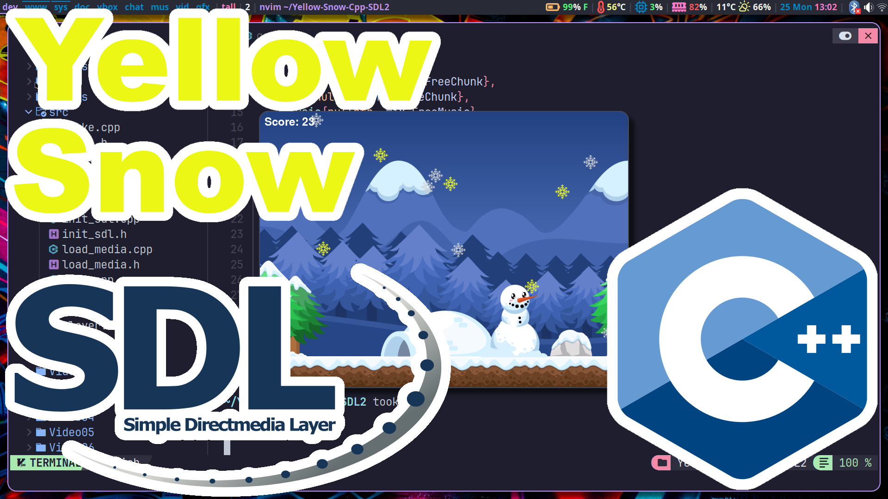

https://www.youtube.com/playlist?list=PLO02jwa2ZaiAQitCgf1VjT8OLEcgRHTUB

# Don't Eat the Yellow Snow! (C++ - SDL2)
Earn points by collecting all the tasty white snow flakes that fall. But watch out for the yellow snow.

# ArchLinux instructions.
```
sudo pacman -S --needed base-devel sdl2 sdl2_image sdl2_mixer sdl2_ttf
cd
git clone https://github.com/ProgrammingRainbow/Yellow-Snow-Cpp-SDL2
cd Yellow-Snow-Cpp-SDL2
make run
```
The Makefile also supports these commands:
```
make rebuild
make clean
make release
make debug
SRC_DIR=Video8 make rebuild run
CXX=clang++ make clean release run
```
# Controls
Left Arrow - Moves left.\
Right Arrow - Moves right.\
Space Bar - Resets the Game.\
Escape - Quits and closes game.\
F - Toggles FPS.
